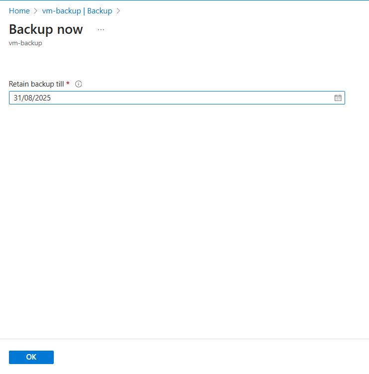
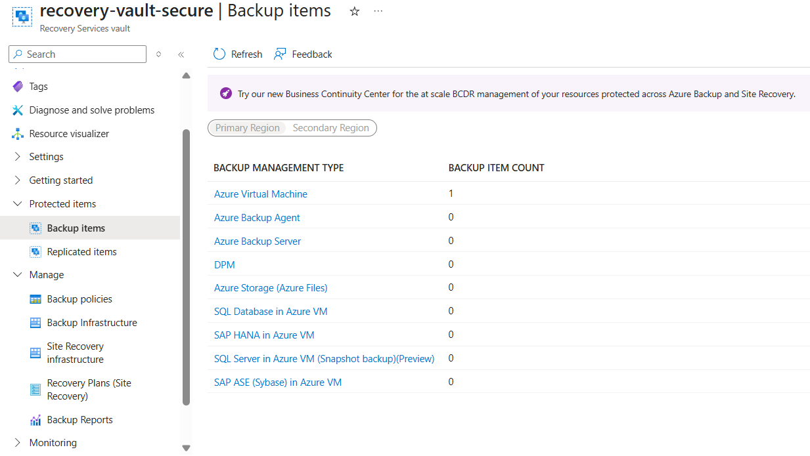
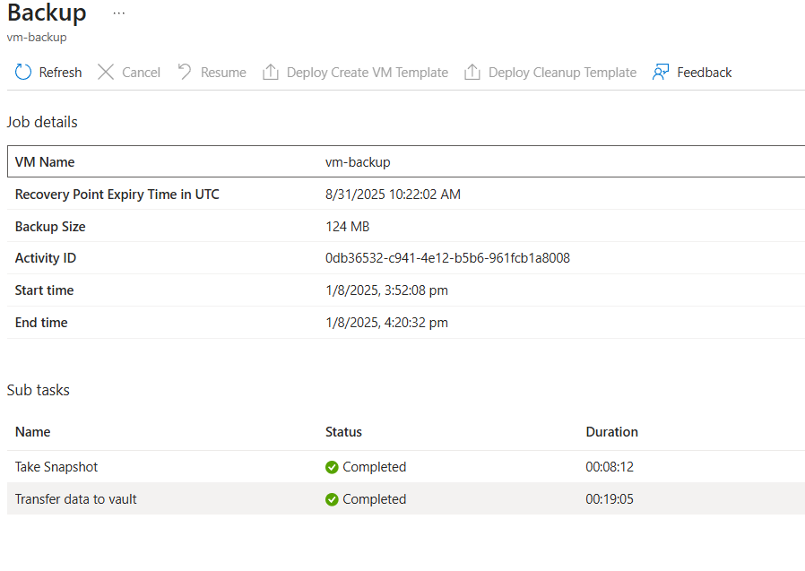

# VM Backup using Recovery Services Vault

Configured backup and recovery point for an **Ubuntu VM** using the Azure Portal. Backup set up through a Recovery Services Vault.

## VM Deployment 

- Deployed an **Ubuntu VM** in Azure via the portal
- Configured networking with NSG, public IP, and VNet

---

## 🛡️ Vault Creation & Backup Configuration

### Backup Enabled

