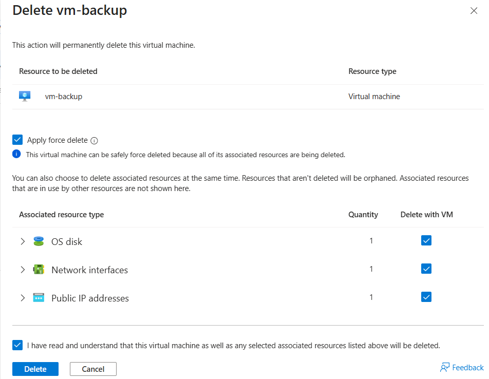
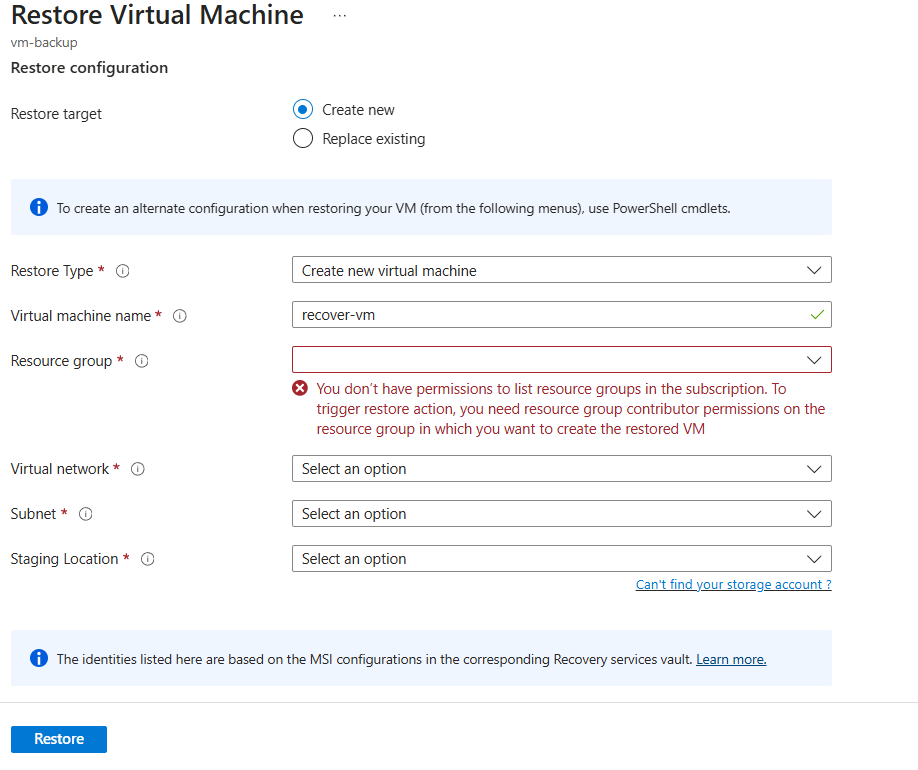

# Recovery Access Control via RBAC

Implemented scoped access for VM recovery operations using Azure Role-Based Access Control (RBAC). Verified that only users with proper permissions can restore a deleted VM from Recovery Services Vault.

## User & Role Setup

- Created a **custom group** (`BackupAdmins`) with Backup  and added a user
  
  
  
- Created a **test user** in Microsoft Entra ID with only Reader access
  
  

## Deleted and Recovered VM

  

  
 - BackupAdmins group member is permitted to restore VM

  

- Backup completed and a new VM is created by restoring old VM

    
  
 - VM recovery with test user — restore blocked due to missing permissions
 
>  **Error Received**  

